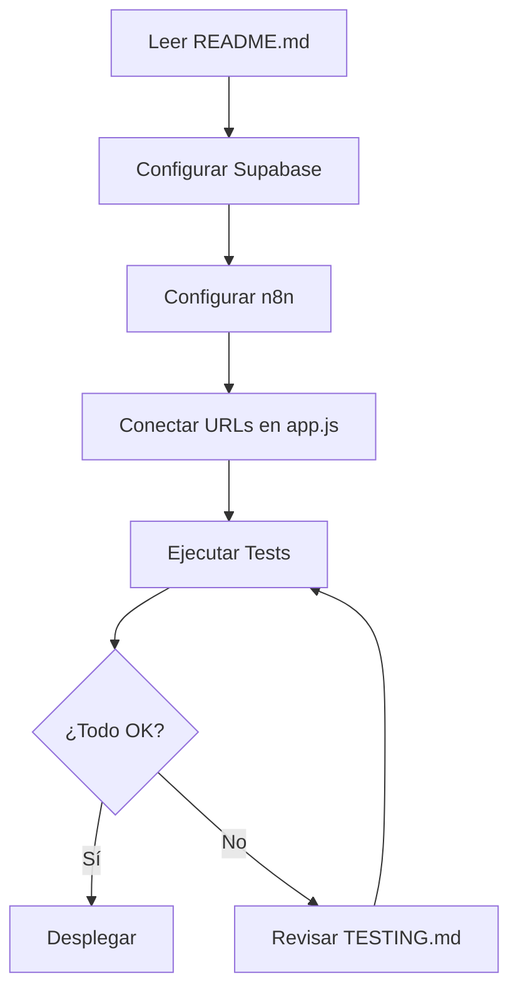

# 📚 Índice de Documentación

Guías completas para configurar y usar la Plataforma de Inscripción de Torneos.

---

## 🚀 Inicio Rápido

1. **[README.md](../README.md)** - Visión general del proyecto
2. **[SETUP_SUPABASE.md](SETUP_SUPABASE.md)** - Configurar base de datos
3. **[SETUP_N8N.md](SETUP_N8N.md)** - Configurar workflows
4. **[TESTING.md](TESTING.md)** - Probar la aplicación

---

## 📖 Guías Detalladas

### Backend

#### [SETUP_SUPABASE.md](SETUP_SUPABASE.md)
Configuración completa de Supabase:
- ✅ Crear proyecto
- ✅ Ejecutar SQL (tablas + índices)
- ✅ Configurar políticas RLS
- ✅ Obtener credenciales
- ✅ Crear vistas (opcional)

**Tiempo estimado:** 15 minutos

---

#### [SETUP_N8N.md](SETUP_N8N.md)
Configuración de workflows n8n:
- ✅ Crear cuenta en n8n
- ✅ Configurar credenciales Supabase
- ✅ Workflow 1: GET Team Data (6 nodos)
- ✅ Workflow 2: UPDATE Registration (7 nodos)
- ✅ Conectar URLs en app.js

**Tiempo estimado:** 30 minutos

---

### Testing

#### [TESTING.md](TESTING.md)
Guía completa de testing:
- ✅ 6 casos de prueba detallados
- ✅ Postman collection
- ✅ Testing responsive
- ✅ Checklist de validación
- ✅ Bugs conocidos

**Tiempo estimado:** 20 minutos

---

## 🗂️ Estructura del Proyecto

```
torneo-inscripcion/
├── docs/                          # 📚 Documentación
│   ├── INDEX.md                   # Este archivo
│   ├── SETUP_SUPABASE.md          # Guía Supabase
│   ├── SETUP_N8N.md               # Guía n8n
│   └── TESTING.md                 # Guía testing
├── directivas/
│   └── plataforma_inscripcion_SOP.md  # Directiva técnica
├── index.html                     # Aplicación principal
├── styles.css                     # Estilos
├── app.js                         # Lógica
├── .env.example                   # Template configuración
└── README.md                      # Documentación principal
```

---

## 🎯 Flujo de Trabajo Recomendado

### Para Desarrolladores



### Para Usuarios Finales

1. **Capitán de Equipo:**
   - Recibe código de equipo
   - Abre la aplicación
   - Completa inscripción

2. **Administrador:**
   - Accede con `?admin=true`
   - Supervisa inscripciones
   - Revisa alertas

---

## 🔧 Configuración por Entorno

### Desarrollo
- Supabase: Plan Free
- n8n: Cloud Free
- RLS: Deshabilitado (opcional)

### Producción
- Supabase: Plan Pro
- n8n: Cloud Starter
- RLS: **Habilitado** (obligatorio)
- HTTPS: Obligatorio
- Backup: Configurado

---

## 📊 Recursos Adicionales

### SQL Útil

**Ver todos los equipos con jugadores:**
```sql
SELECT 
  e.nombre,
  e.codigo,
  COUNT(j.id) AS total_jugadores
FROM equipos e
LEFT JOIN jugadores j ON e.id = j.equipo_id
GROUP BY e.id;
```

**Equipos con alergias:**
```sql
SELECT DISTINCT e.nombre, e.codigo
FROM equipos e
JOIN jugadores j ON e.id = j.equipo_id
WHERE j.alergias IS NOT NULL AND j.alergias != '';
```

### Comandos n8n CLI

```bash
# Exportar workflows
n8n export:workflow --all --output=./backups/

# Importar workflows
n8n import:workflow --input=./backups/workflow.json
```

---

## 🆘 Soporte

### Problemas Comunes

| Problema | Solución |
|----------|----------|
| Webhook no responde | Verificar que workflow esté activo |
| Error 401 | Revisar credenciales Supabase |
| Datos no se guardan | Revisar logs en n8n Executions |
| Estilos no cargan | Verificar ruta de `styles.css` |

### Contacto

- **Issues:** [GitHub Issues](#)
- **Email:** soporte@torneo.com
- **Docs:** Esta carpeta `docs/`

---

## 📝 Changelog

### v1.0.0 (2026-02-17)
- ✅ Versión inicial
- ✅ 3 vistas (Acceso, Capitán, Admin)
- ✅ Integración n8n + Supabase
- ✅ Documentación completa

---

**🎉 ¡Listo para empezar!**

Comienza con [SETUP_SUPABASE.md](SETUP_SUPABASE.md) →
